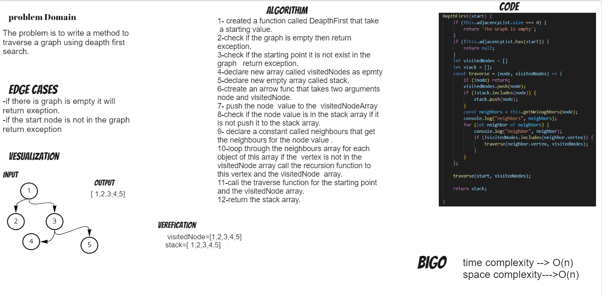

# Depth First Traversal
Depth First Traversal is a type of traversal that visits the nodes of a tree in a depth-first manner.

## Challenge
The problem is to write a method to traverse a graph using deapth first search.

## Approach & Efficiency
i used recursion to traverse the graph. i used a stack to keep track of the nodes that are visited.
Big o time complexity : is O(n) for the worst case senario recursion will run n times depending on the number of nodes in the graph.
Big o space complexity : is O(n) because we use a space that is dependant on the input graph.
## Solution

## Requirements
Ensure your complete solution follows the standard requirements.

