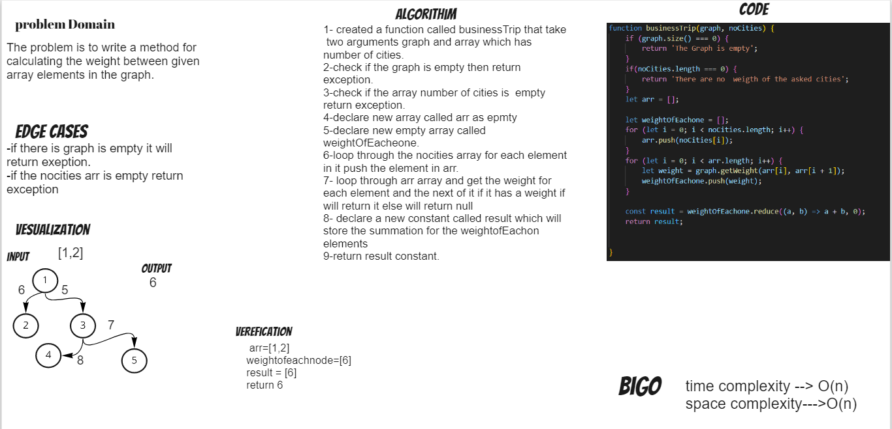

# Challenge Summary
The problem is to write a method for calculating the weight between given array elements in the graph.

## Whiteboard Process

## Approach & Efficiency
i used a graph method to get the weight between two given nodes.
i used for loop to iterate through the nodes.
i used reduce method to sum the weight.
Big o time complexity : is O(n) for the worst case senario for loop will run n times depending on the number of nodes in the graph.
Big o space complexity : is O(1) because we use a space that is dependant on the input graph.

## Solution
```js
business.test.js