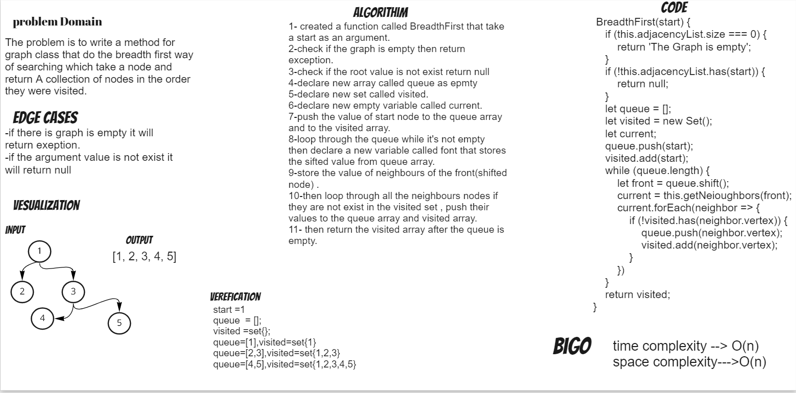

# Challenge Summary
The challange is to write a method for graph class that do the breadth first way of searching which take a node and  return A collection of nodes in the order they were visited.

## Whiteboard Process

## Approach & Efficiency
The approach is to use a queue to keep track of the nodes that are visited.
i used while loop to keep track of the nodes that are visited.
Big o time complexity : is O(n) for the worst case senario while loop will run n times depending on the number of nodes in the graph.
Big o space complexity : is O(n) because we use a space that is dependant on the input graph.
## Solution
graph.test.js
