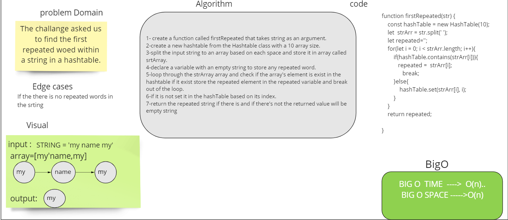

# Challenge Summary
The  challenge  is  to  find  the  first  repeated  word  in  a  string.  If  there  are  no  repeated  wordss,  return  the  empty  string.
## Whiteboard Process

## Approach & Efficiency
* i used for loop to iterate through the string (after it's splited) because i need to check if each element is repeated or not.
* Time complexity : O(n)
* Space complexity: O(n)
## Solution
 npm test first-repeated.test