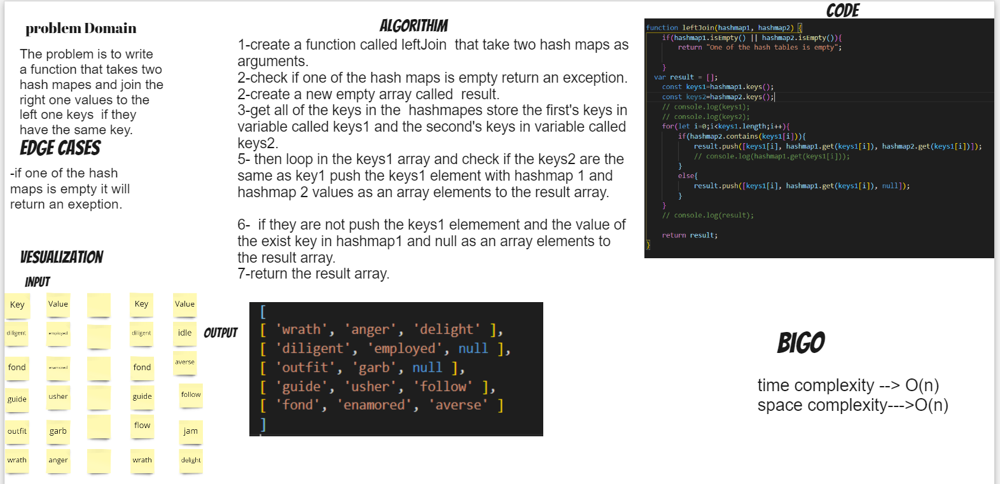

# Hashmap LEFT JOIN
It's a way to join two hashmaps the left one is the main one and the right one is the one we want to join with it.
## Challenge
the challange is to join two hashmaps values if they have the same key or joinning null if they don't have the same key. 
## Approach & Efficiency
i used for loop to iterate through the array and check if the value is present in the hash table.

* Big o time complexity : O(n) That's o(n) while i'm iterating    through an   array .
* Big o space complexity : O(n) because i'm creating a space that depens on the size of the second array input so it will be o(n);
## Solution
