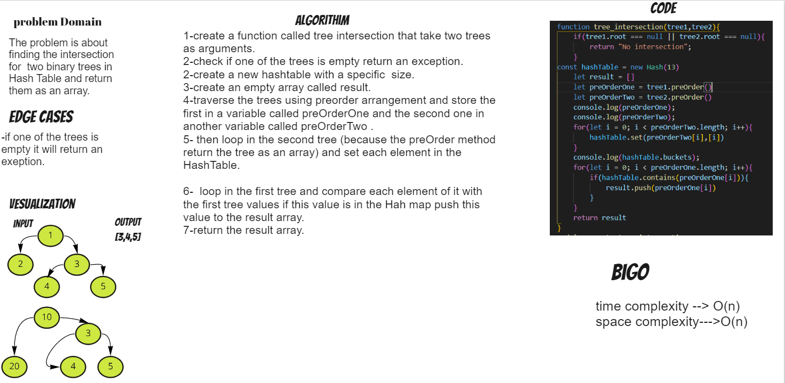

# Challenge Summary
The challange is about finding the intersection for  two binary trees in Hash Table and return them as an array.

## Whiteboard Process

## Approach & Efficiency
i used for loop to iterate through the array and check if the value is present in the hash table.
* BigO Time complexity : O(n).
* BigO Space complexity : O(n).

## Solution
 
 npm  test tree-intersection.test