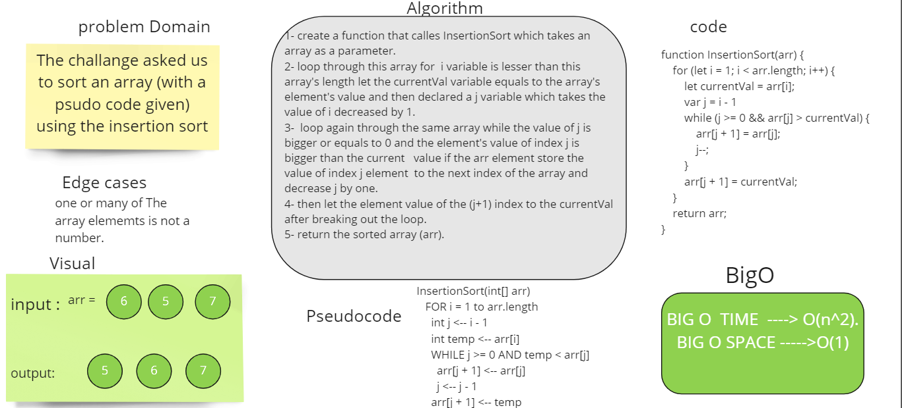

# Challenge Summary
**The challange asked us to sort an array (with a psudo code given) using the insertion sort.**
## Whiteboard Process

## Approach & Efficiency
usesd a for loop approach and while loop the first one to loop though each element indevidually of the array the second one to restrict the comparasion mood. 
## blog.md link
[blog.md](https://github.com/ibrahimalaqoul/data-structures-and-algorithms/blob/insertion-sort/javascript/Insertion-sort/BLOG.md)
## Solution

**npm test insertion-sort**
