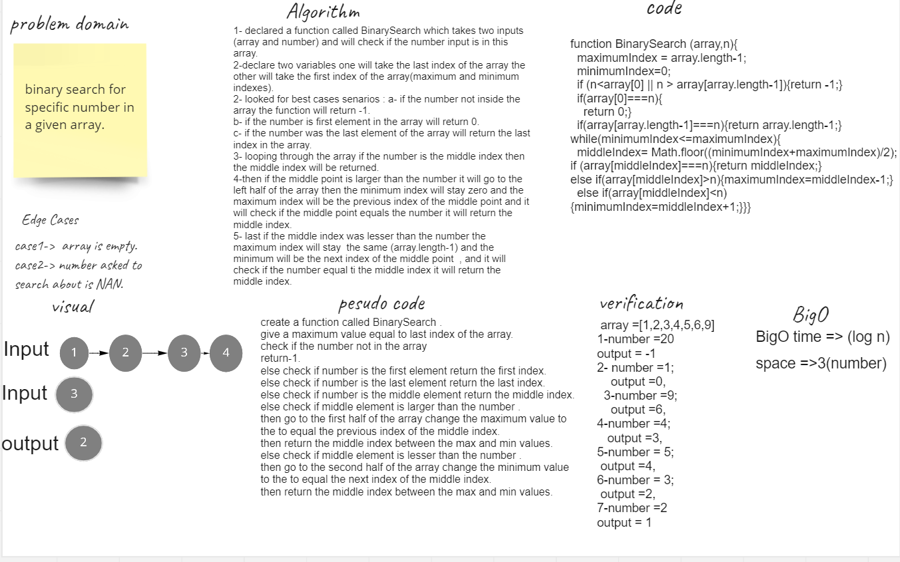

# Binary Search of Sorted Array
Write a function called BinarySearch which takes in 2 parameters: a sorted array and the search key. Without utilizing any of the built-in methods available to your language, return the index of the array’s element that is equal to the value of the search key, or -1 if the element is not in the array.

## Whiteboard Process

## Approach & Efficiency
I used if statements to restrict the odds, also while loop to loop through the array but not index by index , it was parts by parts  ( when i restricted the middle index between the min and max indexes of the array ) .
 * BigO time => (log n).
*  space => 3 (number)