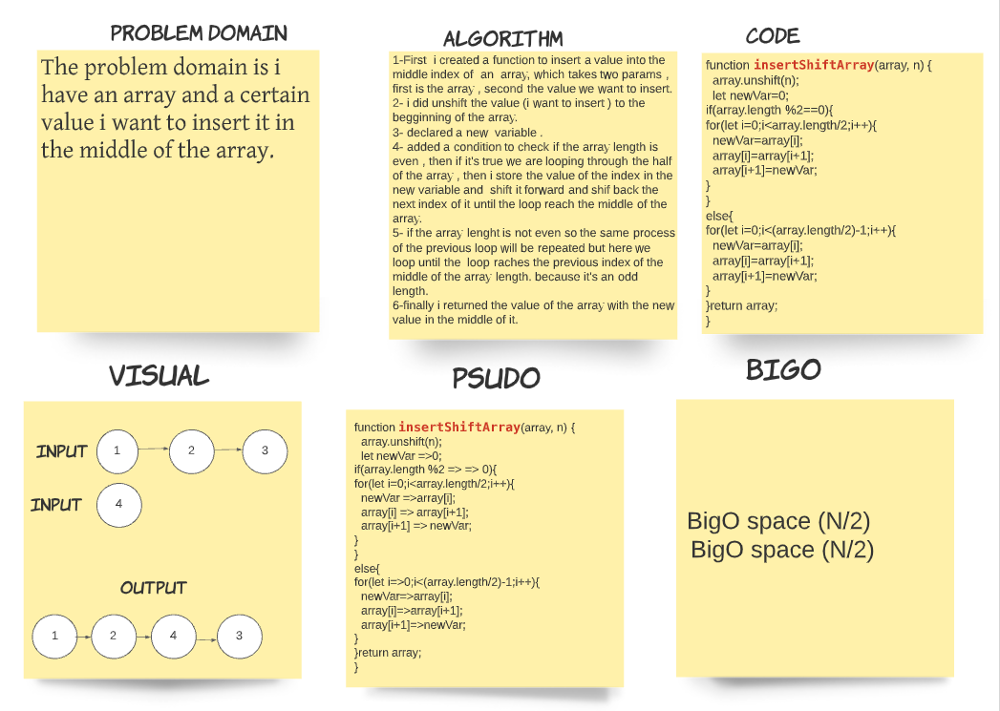

# Insert to Middle of an Array
Recieve an array and a another value(number) , which should be inserted in the middle of the array  (first inserting the number and then shift it to the middle).
## Whiteboard Process

## Approach & Efficiency
i used unshift  to unshif the value to the begginning of the array and  the if statement to check the length of the array, and the for loop method to loop through the half of the array .
BigO time /space
 (N/2)