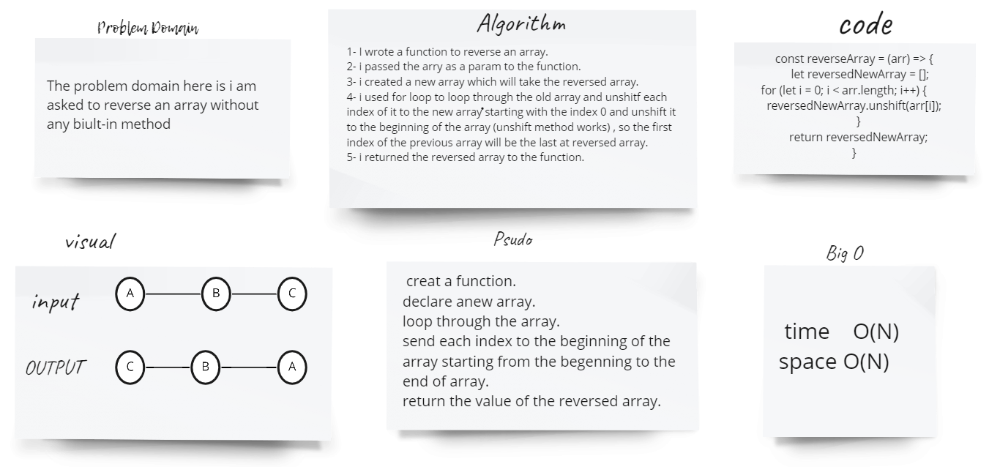

# Reverse an Array
Write a function called reverseArray which takes an array as an argument. Without utilizing any of the built-in methods available to your language, return an array with elements in reversed order.

## Whiteboard Process

## Approach & Efficiency
For me i used for loop with unshift method , because i'd like to start with the first index of the array that's why i had to use the unshift because it send (unshift) the element to the last index of the array.

BigO space/time:
* time   O(N)
* space O(N)