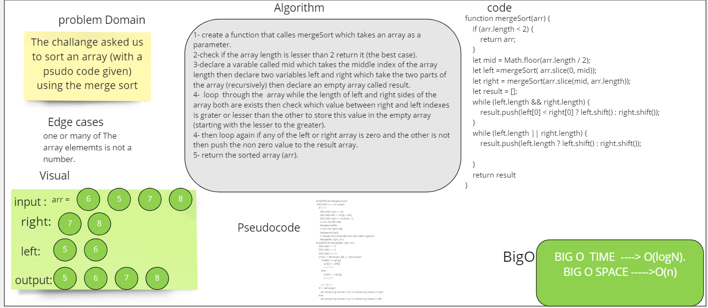

# Challenge Summary
**The challange asked us to sort an array (with a psudo code given) using the insertion sort.**
## Whiteboard Process

## Approach & Efficiency
usesd two while loops the frist to loop though the whole array and split it if it's length was even this one would be enough but if it's odd we need the second loop to push the last (lefted) array elements. 
## blog.md link
[blog.md]()
## Solution
**npm test merge.test**
