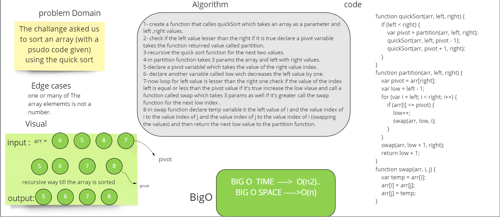

# Challenge Summary
**The challange asked us to sort an array (with a psudo code given) using the insertion sort.**
## Whiteboard Process

## Approach & Efficiency
usesd a for recursive approach and for loop to guarantee the operation will be done the all array's elements. 
## blog.md link
[blog.md]()
## Solution

**npm test quick-sort.test**
