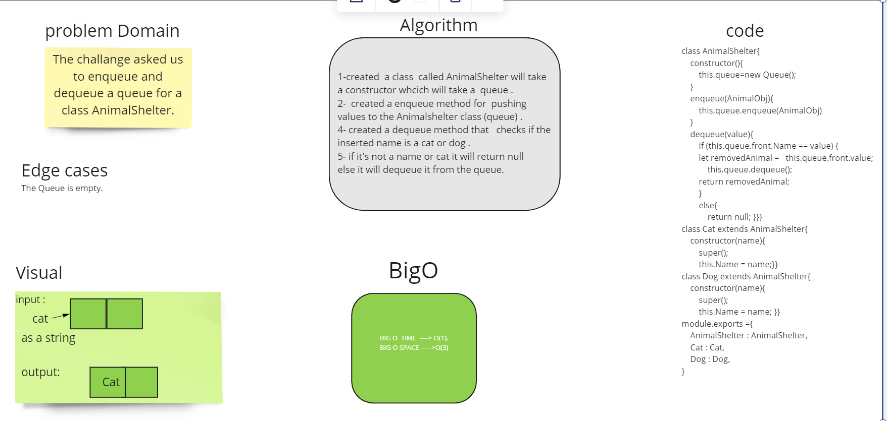

# Challenge Summary
The challange asked us to enqueue and dequeue a queue for a class AnimalShelter.
## Whiteboard Process

## Approach & Efficiency
* Big O enqueue ---->O(1);
* Big O dequeue ---->O(1);

## Solution
stack-queue-animal-shelter.test
