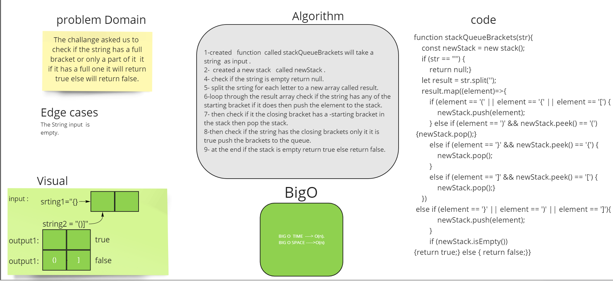

# Challenge Summary
The challange asked us to  check if the string has a full bracket or only a part of it  it if it has a full one it will return true else will return false.
## Whiteboard Process

## Approach & Efficiency
* BigO time ---> O(n)
* BigO space---> O(n)

## Solution
stack-queue-brackets.test.js