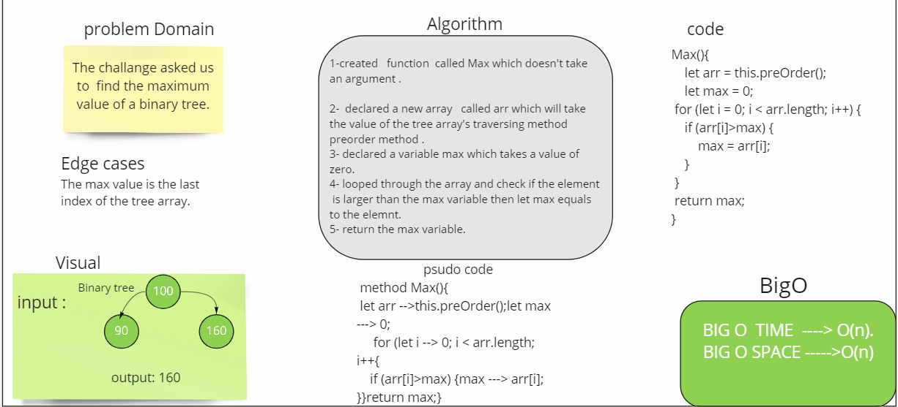
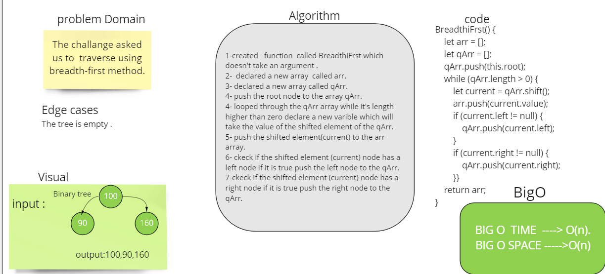

# Trees
Tree is a data structure that has many types Binary tree (k = 2) , binary search trees(left values are lesser than the root value,the right values are greater than the root value) and K-ary trees(k > 2).

## Challenge
The challenge asked us to create a binary tree class has preorder inOrder and postorder travers  methods and binary search trees which is a sub-class of the binary tree class with two newer methods ( add , contains)
## Approach & Efficiency
i used recursion for the traversal methods and while loop with if statement to rstrict all the odds.

preOrder ---> BigO o(n^2)
inOrder ---> BigO o(n^2)
postOrder ---> BigO o(n^2)
add ---> BigO o(n)
contains ---> BigO o(1).
isEmpty ----> BigO o(1).
max ---> BigO o(n).
BreadthFirst ----> BigO o(n)
# whiteBoard 

# solution 
### trees.test.js