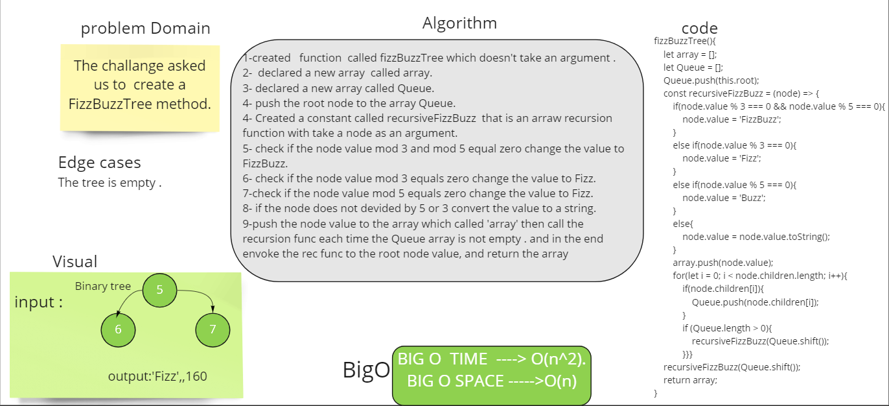

# Trees
Tree is a data structure that has many types Binary tree (k = 2) , binary search trees(left values are lesser than the root value,the right values are greater than the root value) and K-ary trees(k > 2).

## Challenge
The challange asked us to  create a FizzBuzzTree method that put Fizz value to the tree when the value devided by 3 and Buzz when the value devided by 5 and FizzBuss when the value is devided by 3 and 5 , when the value is not devided by 5 and 3 
it will returnt it as string.
## Approach & Efficiency
i used recursion for the fizzBuss to reexecute the function for each value of tree  and for loop to call the recursion function for each value with if statement to rstrict all the odds.

BreadthFirst ----> BigO o(n)
fizzBuzzTree ---> BigO(n^2)
# whiteBoard 

# solution 
### trees.test.js